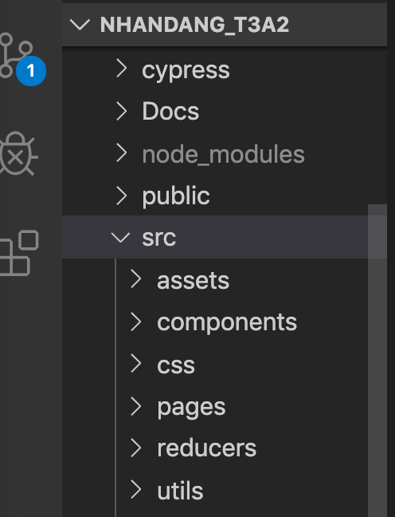
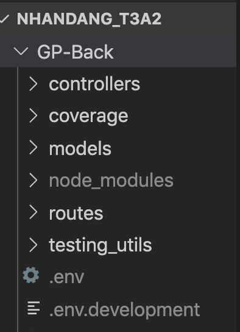
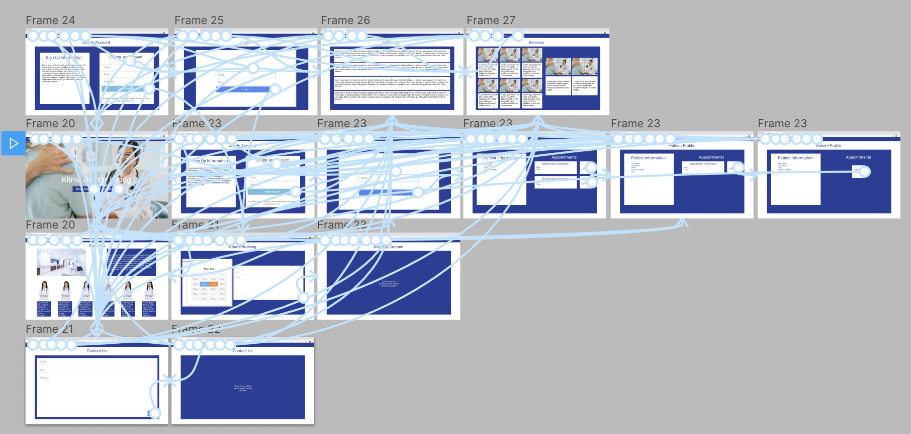
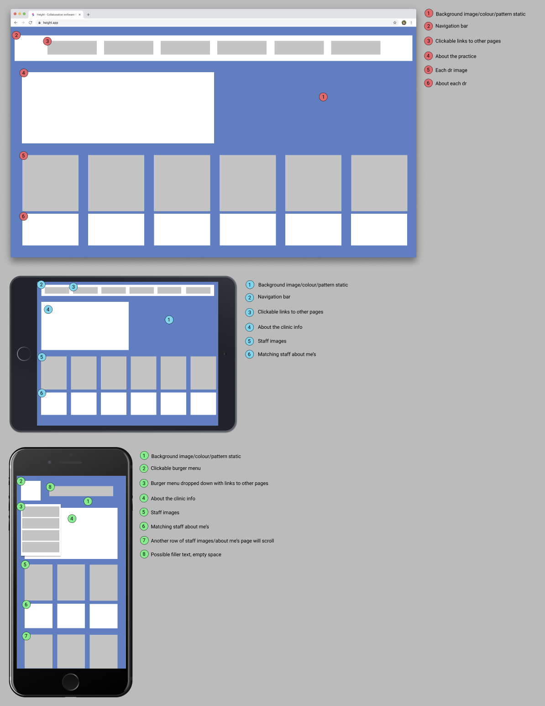
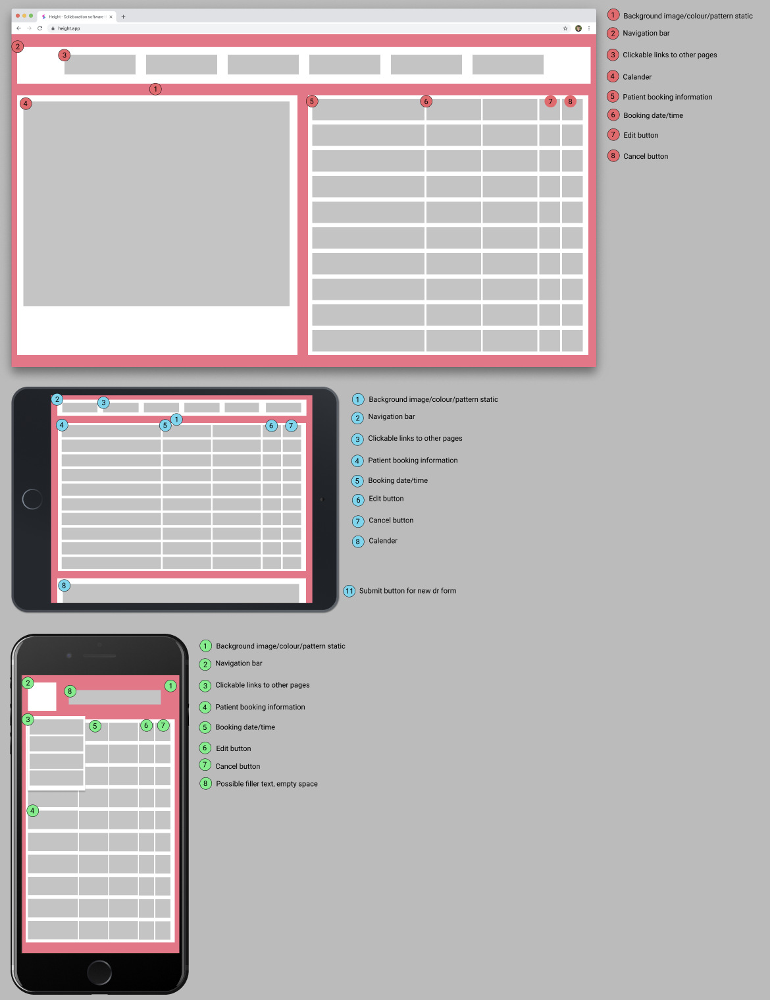
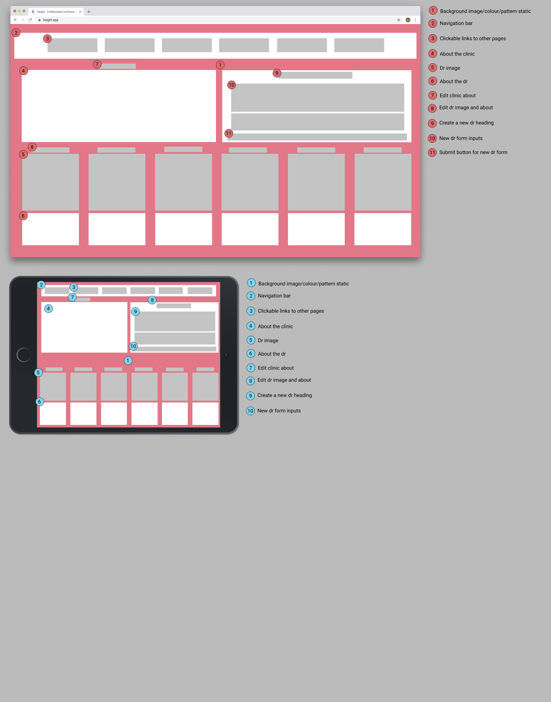
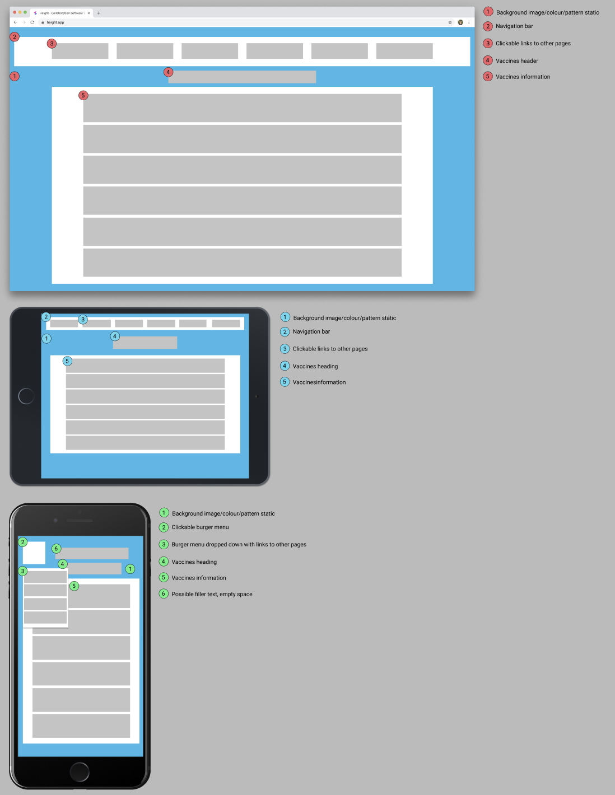
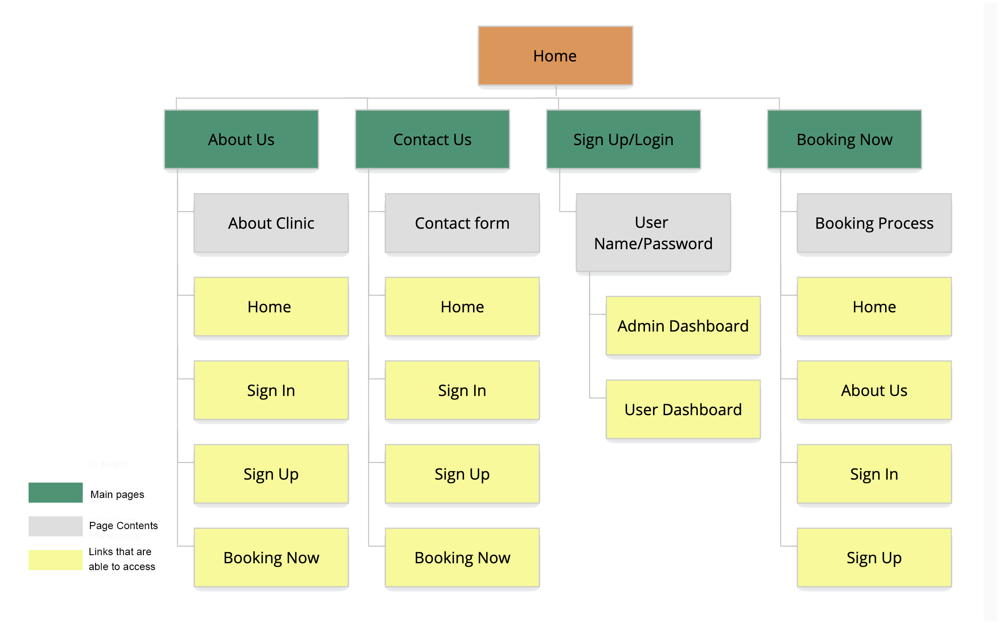

# Real World App - Doctor Leong's Medical Clinic

### By Heng CAI, Christopher DALZIEL, Nhan DANG

## *Part B - Documentation for Coding Component*  

## R10 - Link to deployed website  

The website URL is https://klinik-gp.netlify.com/  

## R11 - Link to Github repository  

* Front end: https://github.com/ChristopherDalziel/GP-Front  

* Back end: https://github.com/ChristopherDalziel/GP-Back  


## R1 - Technology Stack  

This website uses the following technologies:  

**Front end:**

- HTML
- CSS
- React
- Redux Forms

**Back end:**

- Node JS
- Express framework for Node JS
- Mongoose for object modelling

**Database and storage:**

- Cloudinary for user image upload and storing the uploaded images
- MongoDB Atlas document database

**Hosting:**

- Heroku to host the back end content
- Netlify to host the front end content  

## R2 - Well Designed Code  

**Modules**  

The code files for the application is separated into two directories that are linked to two separate Github repositories, GP-Front (for front end) and GP-Back (for back end).   

 
#### Front End  

  

The front end code is categorised into folders based on their purpose:  
* The assets folder contain images that form part of the website's layout.     
* The components folder contains components that make up each page of the website. Some of these components are reused throughout the website such as the create/edit redux forms for the Services and the navigation bar. Aside from the navigation bar, the redux forms and other components are separated into folders within the components folder according to the pages they are used in. For example, the log in, registration and password reset forms are stored in the authentication folder as they deal with authentication.  
* The pages folder contain the code for each page, and the components from the components folder are imported into each of these pages.  
* The reducers folder contains the redux form reducers. 
* The utils folder contains token middleware and session storage functions which are reused throughout the site.  

#### Back End  

  

The back end folder contains four main sub-directories where the modules reside:  

* The controllers folder contains the code where Express interacts with the MongoDB Atlas database to store and retrieve data, as well as token middleware. Controllers are grouped by page and/or functionality. For example, user registration, login and password reset functions are grouped in the users.js file in the controllers folder.
* The models folder contains the mongoose schema for each collection.  
* The routes folder contain the routes used by Express routers. The routes are grouped by page and/or function, for example, all user routes (login, password reset, register) are contained in the users.js routes file.  

**DRY Coding principles**  

Components such as forms are reused where possible, for example, the Services form component is used for both creating and editing a service as the information required is the same. The navigation bar component is contained in the main App.js fie in the Front End so that it only needs to be called on once, without having to be included in the render function of each page. Token middleware is contained in central files and imported where required.   

**Libraries**  

* Cypress is used for automated integration testing. Its dependencies are @cypress/instrument-cra, @cypress/code-coverage, istanbul-lib-coverage and nyc which allows a code coverage report to be generated after running tests in Cypress.  

* Axios is used to shorted the code required to make HTTP requests.  

* Date-fns is used to easily format javascript dates into a user-friendly format to be used to display appointment information to end users. Also, it simplifies the addition and subtraction of dates (e.g. getting the date for yesterday).  
* Dotenv is used to load variables from the .env and .env.development files into process.env variables which can be accessed throughout the application.  

* Google maps is used to graphically display the location of the clinic.  

* React-datepicker is incorporated into the appointment booking form to allow users to select an appointment date and time. It enables selected times such as lunch times to be blocked out and a minimum and maximum date range to be applied.  

* React topbar progress indicator allows a progress bar to be displayed to indicate that a page is still loading.  

* Redux-form allows the use of redux forms to simplify the creation and storage of form contents as well as form validation.  

* Bcrypt is used for hashing and salting passwords 

* Cors is used to enable data to be transmitted between the back end and the front end, allowing the use of a custom API.  
* JSON web token allows the creation of a token based on the user's email and admin status which is used in authentication.  

* Mongoose unique validator is used to allow mongoose to validate if a value is unique. It is used to check the users collection for an existing email address during the registration process, and will throw an error if the email address already exists in the system.  

* Morgan is used to log HTTP requests.  

* Nodemailer is used to send emails to users after a post request. 

* Nodemon is used to allow the express server to restart automatically after each code change.  

* UUIDV1 is used to generate a unique token which is used for validating users when they a password reset is requested. 

* Jest and Supertest is used to unit test end points. The test files are stored in the back end Routes folder and picked up by Jest/Supertest.  

**Code Flow Control**  

During the coding process we used the user stories as a basis for the code control flow. Each function usually contains the expected output in the case of a positive use case, and includes error handling to accommodate for negative use cases.  

For example, this is the user story for making an appointment (from part A): 

  

The resultant code is (see comments included in the code block):

````javascript
//on submission of the booking form:
  bookingSubmit = async values => {
    try {
      //Attempt to create a new booking by creating a new booking document from the values obtained from the form, then writing this value to the database 
      const newBooking = values;
      await axios
        .post(
          process.env.REACT_APP_BACKEND_URL + "/appointments/new",
          newBooking
        )
        .then(response => {
          //if the booking creation is successful, the server will respond with the booking data
          let bookingDetails = response.data;
          //the booking data from the server response will be used to send an email to the user to confirm the booking
          axios
            .post(
              process.env.REACT_APP_BACKEND_URL + "/mail/appointment",
              bookingDetails
            )
            //if the email is successfully sent, the user will be redirected to a success page to inform them that the booking is successful and an email has been sent
            .then(this.props.history.push("/success"))
            .catch(err => {
              //if an error occurs during the email process, the error message will be displayed
              console.log(err);
              this.setState({errors: err.response.data})
            });
        });
        //if an error occurs during the booking submission process, an error message will be displayed. 
    } catch (err) {
      console.log(err);
      this.setState({errors: err.response.data})
    }
  };
````

**Applies Object Oriented (OO) principles/patterns**  

Classes and objects are used extensively throughout the application. Each component has its own class and each page is written as a class with the functionality for that page contained in various class methods. The following structure is usually followed:

a) Class Name  
b) A state object containing the keys with values that are subject to change  
c) A componentDidMount function to fetch data from the MongoDB database and render it on the page  
d) Functions to control page functionality. For example, if a page contains a form component, there is a function to handle the form submission.  
e) A render function to display the contents of the page

For example, when a booking form is completed in the front end, a new booking object is created from the values of the form. The object is then saved as a document in the corresponding collection via a HTTP request to the back end.  


## R12 - *Part A - Documentation*
## R1 - Description of your website

The website is for a general practice clinic in Malaysia called Klinik Dr Leong Subang Jaya (Dr Leong's medical clinic). It is a fairly new medical clinic opened in early 2019 that does not have a website up and running yet. Currently, the clinic uses a Facebook page to provide information such as opening hours and contact information for patients. The website is intended to be used to replace the clinic's Facebook page as the main source of information about the clinic. It is intended to be used by both clinic staff and patients.

For patients and unregistered users, the site can be used to view information about the clinic including the staff information, opening hours and contact information, as well as send a general email enquiry. Patients registered with an account an make an appointment by completing a form. They will have access to a user dashboard where they can update their information and view and modify appointments.

Clinic staff will have administrator accounts. Upon login they will be taken to a dashboard where they can view the current day's appointments. They will be able to modify appointment details and manage user accounts, as well as create, edit, update and delete staff profiles and clinic information.

The website will use the following technologies:

Front end:

- HTML
- CSS
- React
- Redux Forms

Back end:

- Node JS
- Express framework for Node JS
- Mongoose for object modelling

Database and storage:

- Amazon S3 bucket for storage of static images
- MongoDB Atlas document database

Hosting:

- Heroku to host the back end content
- Netlify to host the front end content

## R2 - Dataflow diagram


## R3 - Application Architecture Diagram


## R4 - User Stories


## R5 - Wireframes

### Figma Protoype Example

[Prototype Example](https://www.figma.com/proto/DfgmSwycMitQGgsmjiohfW/T2A3?node-id=141%3A0&scaling=contain)


#### Figma Prototyping Paths



#### Home Page


#### About The Clinic Page



#### Patient Sign Up Page


#### Patient Profile Page


#### Make A Booking Page


#### Contact Clinic Page


#### Admin Booking Management Page



#### Admin Edit Clinic Information Page



## Example Mockups For The Client

#### Home Page


#### About Page


#### Contact Page


## New Pages Added After Speaking With Client

#### Services Page


#### Vaccines Page



# Sitemap



## R6 - Project Management

### Trello Screenshots


### GANTT Chart for timeline planning


[GANTT Chart - Excel Document](./Docs/Gantt_Chart.xlsx)
