# Real World App - Doctor Leong's Medical Clinic

### By Heng CAI, Christopher DALZIEL, Nhan DANG

## _Part B - Documentation for Coding Component_

## R10 - Link to deployed website

The website URL is https://klinik-gp.netlify.com/

## R11 - Link to Github repository

- Front end: https://github.com/ChristopherDalziel/GP-Front

- Back end: https://github.com/ChristopherDalziel/GP-Back

## R1 - Technology Stack

This website uses the following technologies:

**Front end:**

- HTML
- CSS
- React
- Redux Forms

**Back end:**

- Node JS
- Express framework for Node JS
- Mongoose for object modelling

**Database and storage:**

- Amazon S3 bucket for storage of static images
- MongoDB Atlas document database

**Hosting:**

- Heroku to host the back end content
- Netlify to host the front end content

## R2 - Well Designed Code

**Modules**

The code files for the application is separated into two directories that are linked to two separate Github repositories, GP-Front (for front end) and GP-Back (for back end).

#### Front End

The front end code is categorised into folders based on their purpose:

- The assets folder contain images that form part of the website's layout.
- The components folder contains components that make up each page of the website. Some of these components are reused throughout the website such as the create/edit redux forms for the Services and the navigation bar. Aside from the navigation bar, the redux forms and other components are separated into folders within the components folder according to the pages they are used in. For example, the log in, registration and password reset forms are stored in the authentication folder as they deal with authentication.
- The pages folder contain the code for each page, and the components from the components folder are imported into each of these pages.
- The reducers folder contains the redux form reducers.
- The utils folder contains token middleware and session storage functions which are reused throughout the site.

#### Back End

The back end folder contains four main sub-directories where the modules reside:

- The controllers folder contains the code where Express interacts with the MongoDB Atlas database to store and retrieve data, as well as token middleware. Controllers are grouped by page and/or functionality. For example, user registration, login and password reset functions are grouped in the users.js file in the controllers folder.
- The models folder contains the mongoose schema for each collection.
- The routes folder contain the routes used by Express routers. The routes are grouped by page and/or function, for example, all user routes (login, password reset, register) are contained in the users.js routes file.

**DRY Coding principles**

Components such as forms are reused where possible, for example, the Services form component is used for both creating and editing a service as the information required is the same. The navigation bar component is contained in the main App.js fie in the Front End so that it only needs to be called on once, without having to be included in the render function of each page. Token middleware is contained in central files and imported where required.

**Libraries**

- Cypress is used for automated integration testing. Its dependencies are @cypress/instrument-cra, @cypress/code-coverage, istanbul-lib-coverage and nyc which allows a code coverage report to be generated after running tests in Cypress.

- Axios is used

## R8 - Provides Evidence of UAT (User Testing)

#### Development Environment

#### Production Environment

## R9 Utilises a Form Testing Framework

## R12 - _Part A - Documentation_

## R1 - Description of your website

The website is for a general practice clinic in Malaysia called Klinik Dr Leong Subang Jaya (Dr Leong's medical clinic). It is a fairly new medical clinic opened in early 2019 that does not have a website up and running yet. Currently, the clinic uses a Facebook page to provide information such as opening hours and contact information for patients. The website is intended to be used to replace the clinic's Facebook page as the main source of information about the clinic. It is intended to be used by both clinic staff and patients.

For patients and unregistered users, the site can be used to view information about the clinic including the staff information, opening hours and contact information, as well as send a general email enquiry. Patients registered with an account an make an appointment by completing a form. They will have access to a user dashboard where they can update their information and view and modify appointments.

Clinic staff will have administrator accounts. Upon login they will be taken to a dashboard where they can view the current day's appointments. They will be able to modify appointment details and manage user accounts, as well as create, edit, update and delete staff profiles and clinic information.

The website will use the following technologies:

Front end:

- HTML
- CSS
- React
- Redux Forms

Back end:

- Node JS
- Express framework for Node JS
- Mongoose for object modelling

Database and storage:

- Amazon S3 bucket for storage of static images
- MongoDB Atlas document database

Hosting:

- Heroku to host the back end content
- Netlify to host the front end content

## R2 - Dataflow diagram

## R3 - Application Architecture Diagram

## R4 - User Stories

## R5 - Wireframes

### Figma Protoype Example

[Prototype Example](https://www.figma.com/proto/DfgmSwycMitQGgsmjiohfW/T2A3?node-id=141%3A0&scaling=contain)

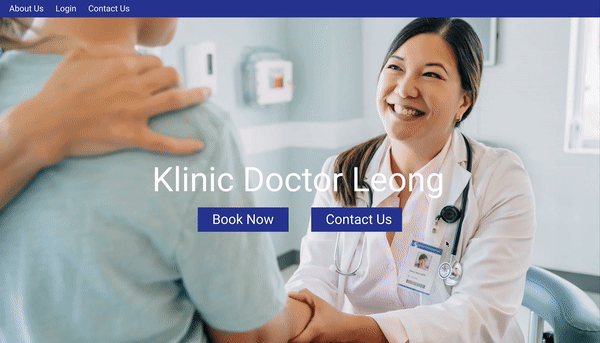

#### Figma Prototyping Paths

#### Home Page

#### About The Clinic Page

#### Patient Sign Up Page

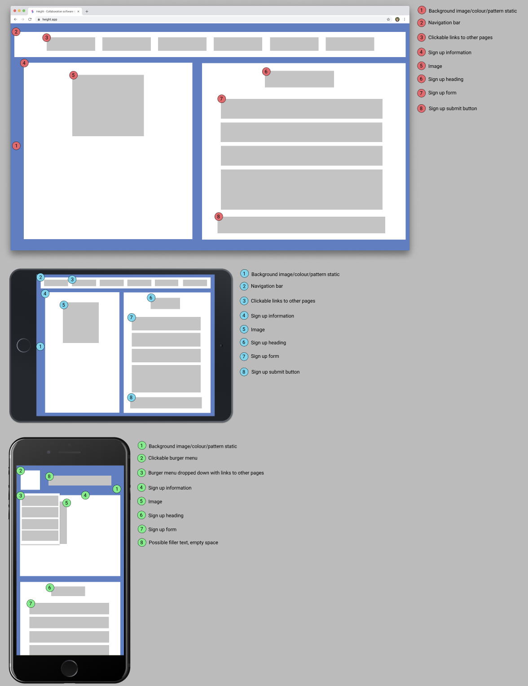

#### Patient Profile Page

#### Make A Booking Page

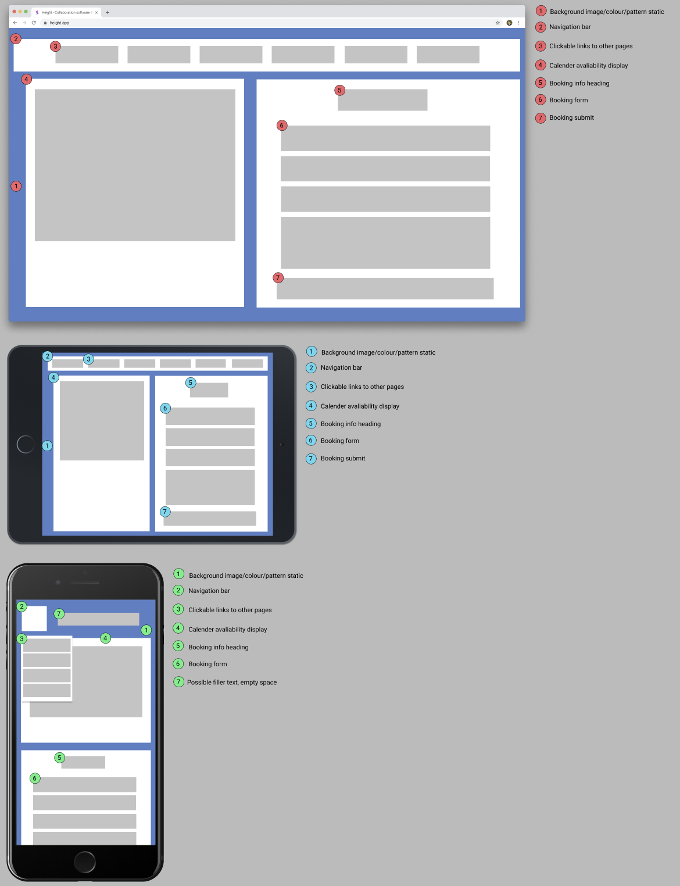

#### Contact Clinic Page

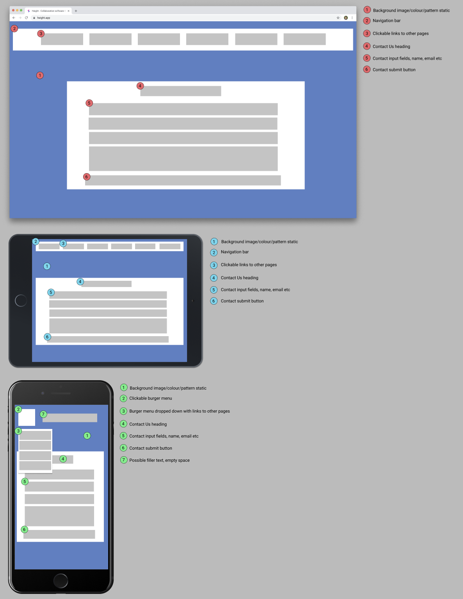

#### Admin Booking Management Page

#### Admin Edit Clinic Information Page

## Example Mockups For The Client

#### Home Page

#### About Page

#### Contact Page

## New Pages Added After Speaking With Client

#### Services Page

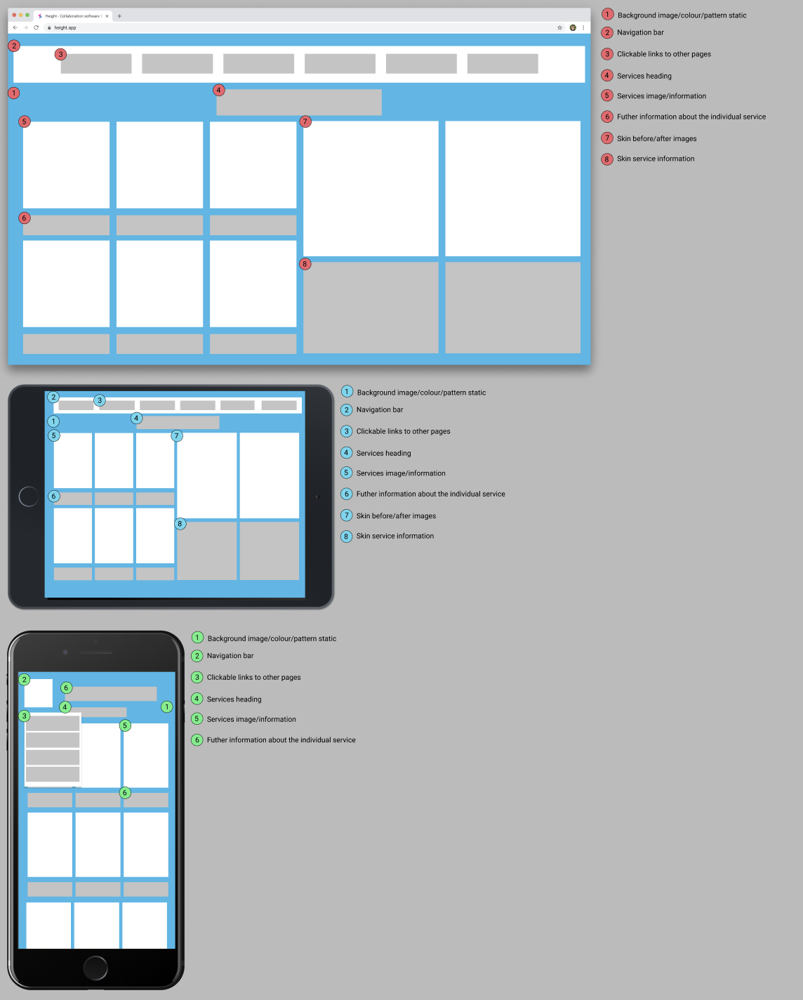

#### Vaccines Page

# Sitemap

## R6 - Project Management

### Trello Screenshots

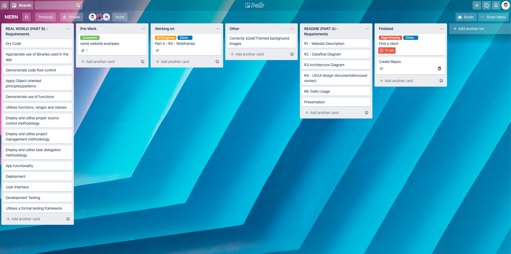

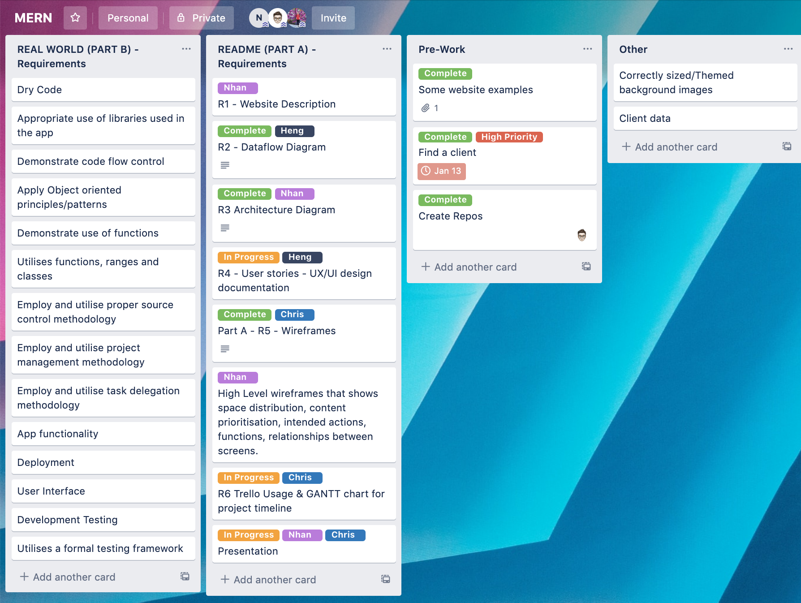

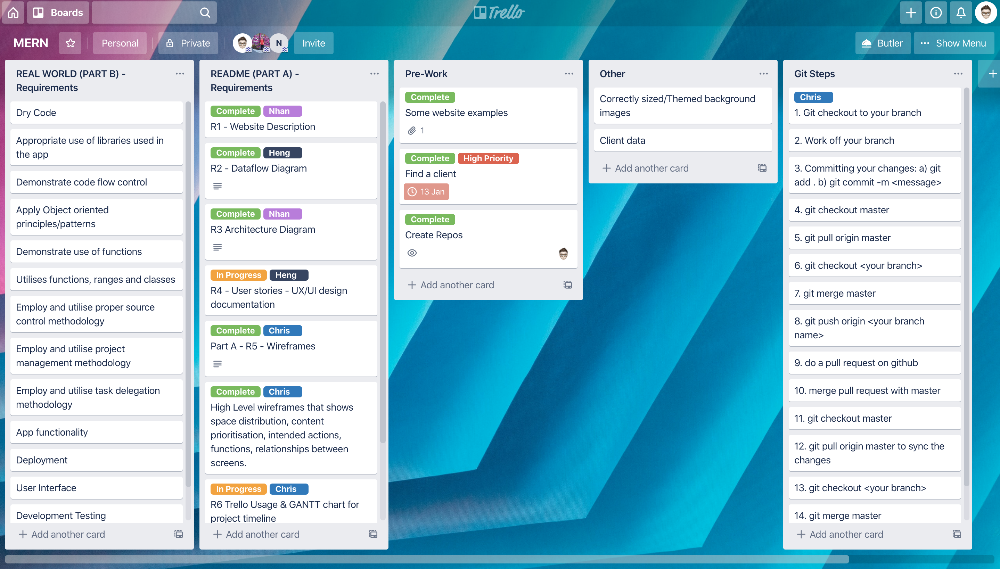

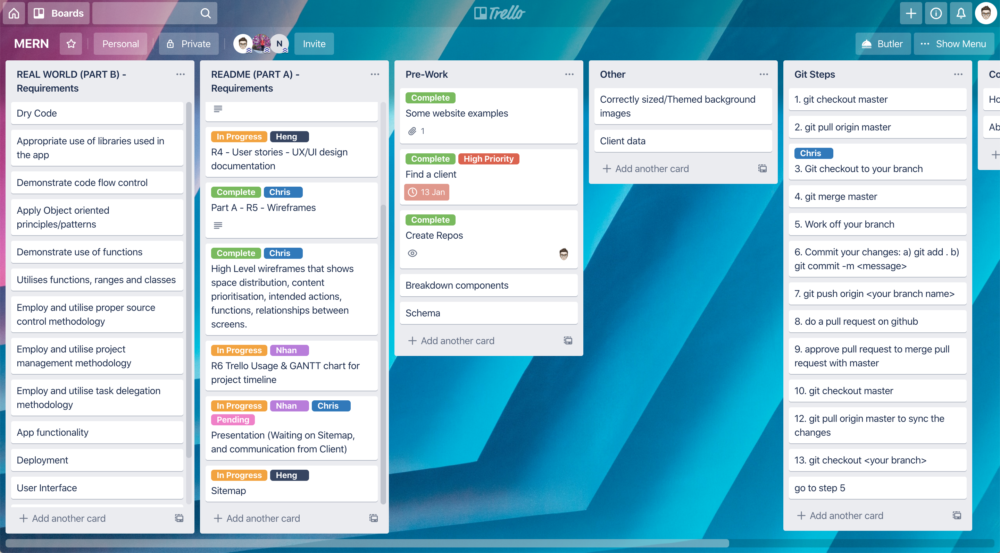

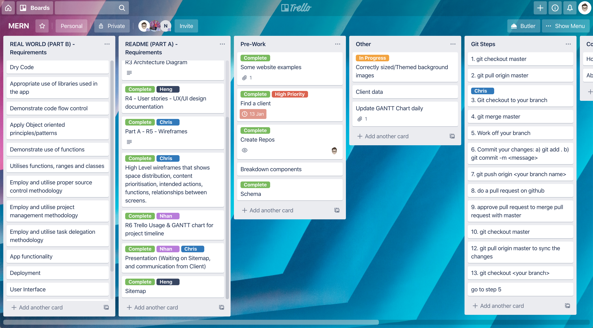

### GANTT Chart for timeline planning

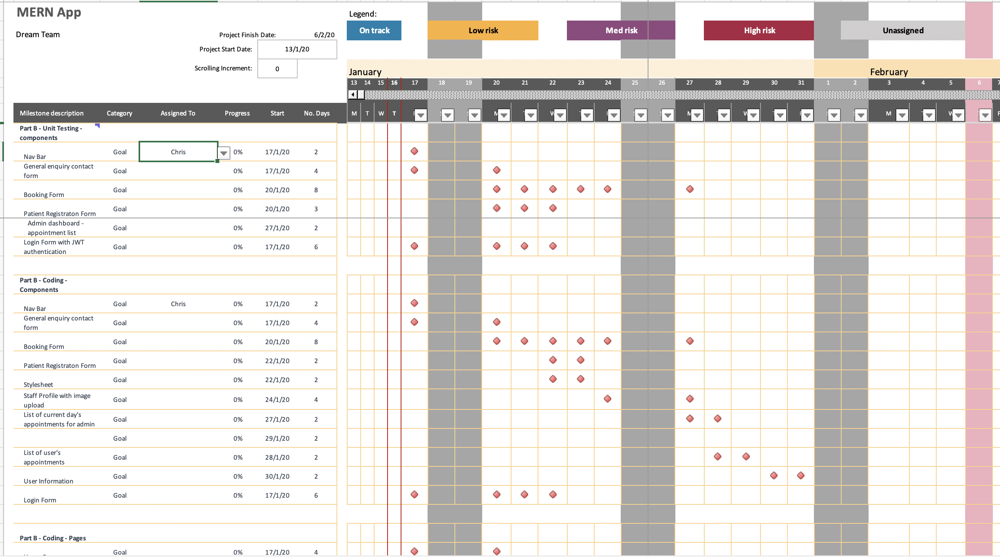

[GANTT Chart - Excel Document](./Docs/Gantt_Chart.xlsx)
